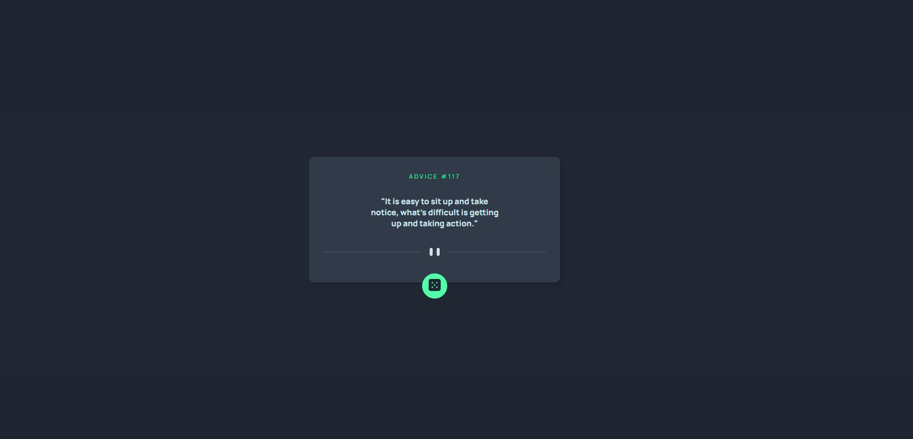

# 🎯 Challenge Overview

This is a solution to the "Advice Generator App Starter Code" exercise from the **DevQuest course**, based on a challenge provided by the website **Frontend Mentor**.

The goal was to create a responsive layout for an advice generator app, designed to work well on both desktop and mobile screens. The project also required some specific text formatting.

---

## 🛠️ Technologies Used

- **HTML5**
- **CSS3**

---

## 🧱 Layout & Responsiveness

- I used **Flexbox** for the desktop layout structure.
- For responsiveness, I used the `<picture>` tag to handle image switching based on screen size.
- The card size was already suitable for most modern smaller screens, so minimal additional adjustments were needed.

---

## 🎨 Styling Notes

- Since I'm still learning advanced styling techniques, I used the `white-space` property to manage line breaks within the paragraph text.
- For the title's visual style, I applied the `letter-spacing` property.

---

## ✅ Final Thoughts

I believe I was able to achieve the expected layout, but I still plan to **improve and refine the code** as I continue learning.
